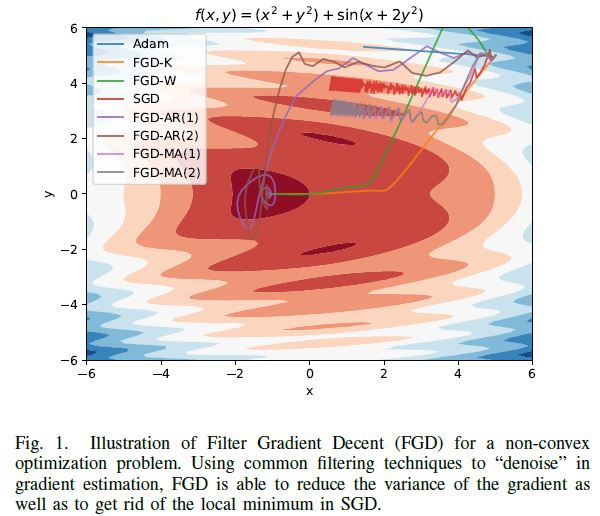

# Filter-Gradient-Decent

Course project for ECE 251C UCSD. Code for paper,

**Stochastic Gradient Variance Reduction
by Solving a Filtering Problem**

In this paper, we propose Filter Gradient Decent (FGD), an
efficient stochastic optimization algorithm that make consistent
estimation of the local gradient by solving an adaptive filtering
problem with different design of filters.

## Usage
- To do later

